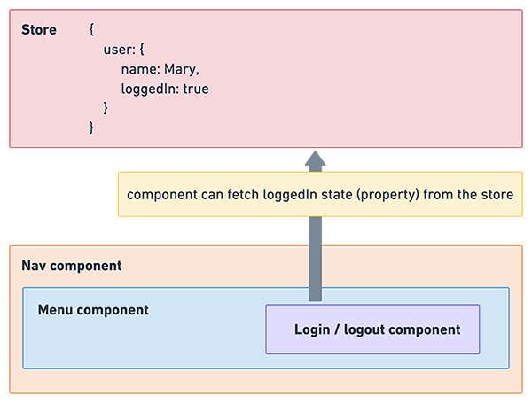

# Lesson 3 - Redux

The code for this lesson can be found on [this branch](https://github.com/cnnrbrn/noroff-react-content-part-2-code/tree/lesson-3).

---

So far we have only passed props directly into child components, apart from when we used the `theme` object in Styled Components. Styled Components allowed us to access the `theme` properties from any component because it uses a form of application state management.

State management allows us to access props and data from a `store` no matter where the component might be in the component tree. The `store` is an object with properties.

<!--  -->



[Redux](https://redux.js.org/) is a state management library with a lot of legacy code weight. It can be a difficult libary to understand, and if you feel lost at first you are joining just about every other developer in the world.

It too will take a fair bit of configuration to get working.

## Configuration

We need to install `redux`, `react-redux` and `next-redux-wrapper`:

```js
npm install redux react-redux next-redux-wrapper
```

We also want to install `redux-devtools-extension` so that we can use the Redux Devtools browser extension: [Chrome version](https://chrome.google.com/webstore/detail/redux-devtools/lmhkpmbekcpmknklioeibfkpmmfibljd), [Firefox version](https://addons.mozilla.org/en-US/firefox/addon/reduxdevtools/).

```js
npm install -D redux-devtools-extension
```

We need to modify `pages/app.js` again to get Redux to work with Next and to make the store available across the app:

```js
import React from "react";
import App from "next/app";
import { Provider } from "react-redux";
import withRedux from "next-redux-wrapper";
import { ThemeProvider } from "styled-components";
import theme from "../constants/theme";
import { initStore } from "../redux/store";

export default withRedux(initStore, { debug: true })(
    class MyApp extends App {
        render() {
            const { Component, pageProps, store } = this.props;
            return (
                <Provider store={store}>
                    <ThemeProvider theme={theme}>
                        <Component {...pageProps} />
                    </ThemeProvider>
                </Provider>
            );
        }
    }
);
```

We're going to build a trivial counter as a simple introduction to Redux. We'll keep all our Redux-related code in a folder called `redux`.

### The store

`redux/store.js`:

```js
import { createStore, compose } from "redux";
import reducers from "./reducers";

const devtools = process.browser && window.__REDUX_DEVTOOLS_EXTENSION__ ? window.__REDUX_DEVTOOLS_EXTENSION__() : f => f;

export const initStore = (initialState = {}) => {
    return createStore(reducers, initialState, compose(devtools));
};
```

The `store` contains the state (data) we want to make available to our components, to both read and update. We are also configuring the `Redux DevTools` extension to work with our app here. The imported `reducers` we'll cover next.

### Reducers

`Reducers` are responsible for updating the store. They receive `actions` sent to the store by components in the app and decide how to update the store based on the type of actions they receive and what data the actions may contain. We say the actions are `dispatched` to the store.

Reducers don't actually mutate (change) the store's current state. They take the current state, add the changes and then produce a new state object. This means you can go back to an old version of the store.

In the `redux/reducers` folder we'll have two files.

`redux/reducers/buttonReducer` contains the actual reducer. Inside is a `switch` statement that checks which `action type` it has been sent, and then creates a new version of the store based on that type. Here we are only checking for the action type `CLICK_BUTTON`. We're keeping the types in a separate types file so that they can be imported and used by both the reducers and the actions.

```js
import { CLICK_BUTTON } from "../types";

const initialState = {
    clickCount: 0,
};

export default (state = initialState, action) => {
    switch (action.type) {
        case CLICK_BUTTON:
            return { ...state, clickCount: state.clickCount + 1 };

        default:
            return state;
    }
};
```

Our store must have an initial state. Here we have created an `initialState` state object with one property `clickCount` with a default value of 0. If the `CLICK_BUTTON` action is sent to the store, our reducer will add 1 to `clickCount`.

On this line

```js
return { ...state, clickCount: state.clickCount + 1 };
```

we're using the [object spread operator](https://redux.js.org/recipes/using-object-spread-operator) to create a copy of the current state object and update this new object with the new `clickCount` value. The new object then becomes the value of the store.

In `redux/reducers/index.js` we import all reducers we need to, combine them together and export them. We only have one reducer but it is very common to split your reducers into separate files.

```js
import { combineReducers } from "redux";
import buttonReducer from "./buttonReducer";

const rootReducer = combineReducers({
    button: buttonReducer,
});

export default rootReducer;
```

### Actions

Actions are plain JavaScript objects that are sent to the store and get handled by the reducers. They always have a `type` property:

```js
{
    type: "DO_SOMETHING_PLEASE";
}
```

Often they have a second property which is the data that is getting sent to the store. This second property can be called anything; it is often called `payload`.

```js
    {
        type: "DO_SOMETHING_PLEASE",
        payload: "This is the thing you must do"
    }
```

`Action creators` are functions that return `actions`. These are the functions that our components will call to send an action to the store.

In `redux/actions.js` we have one `action creator` which returns an `action` with only a `type` property. The `CLICK_BUTTON` type is the one our `reducer` is checking for.

```js
import { CLICK_BUTTON } from "./types";

export function clickButton() {
    return { type: CLICK_BUTTON };
}
```

### Types

Our `redux/types.js` file contains the actions we import in both our reducers and actions. It's a good idea to keep your types in constants to avoid errors when typing out strings.

```js
export const CLICK_BUTTON = "CLICK_BUTTON";
```

## Testing

Add a menu item called `Redux Text` into the nav:

```js
<Link href="/redux-test">
    <a>
        <Nav.Link as="span">Redux Test</Nav.Link>
    </a>
</Link>
```

Add a new page `pages/redux-test.js`:

```js
import React from "react";
import Layout from "../components/layout/Layout";
import CounterButton from "../components/ui/CounterButton";
import CounterLabel from "../components/ui/CounterLabel";

export default function ReduxTest() {
    return (
        <Layout>
            <h2>
                Count: <CounterLabel />
            </h2>
            <CounterButton />
        </Layout>
    );
}
```

The `CounterButton` component will call the `clickButton` action creator function to update the store, and the `CounterLabel` component will retrieve the `clickCount` property from the store and display it.

In `components/ui/CounterButton.js`:

```js
import React from "react";
import PropTypes from "prop-types";
import { connect } from "react-redux";
import Button from "react-bootstrap/Button";
import { clickButton } from "../../redux/actions";

function CounterButton({ clickButton }) {
    return <Button onClick={() => clickButton()}>Add 1</Button>;
}

CounterButton.propTypes = {
    clickButton: PropTypes.func.isRequired,
};

export default connect(null, { clickButton })(CounterButton);
```

`connect` is a higher order component (HOC) that wraps our `CounterButton` component to give it access to the store.

Its first argument is a function that we pass in to retrieve data from the store. We don't need to access any data from the store in this component so we pass in `null`.

The second argument is an object of functions we want to dispatch from the component. We are passing in our `clickButton` function.

Clicking our button component will now update the `clickCount` property in the store.

In `components/ui/CounterLabel.js`:

```js
import React from "react";
import PropTypes from "prop-types";
import { connect } from "react-redux";
import Badge from "react-bootstrap/Badge";

function CounterLabel({ count }) {
    return (
        <Badge variant="secondary" size="large">
            {count}
        </Badge>
    );
}

CounterLabel.propTypes = {
    count: PropTypes.number.isRequired,
};

function mapStateToProps(store) {
    return {
        count: store.button.clickCount,
    };
}

export default connect(mapStateToProps)(CounterLabel);
```

We are creating a function called `mapStateToProps` that we pass as the first argument to `connect`.

This function will receive the `store` object as an argument. Inside, we return an object. We're looking for the `clickCount` property of the `button` object (our reducer was called `button`) on the `store` object.

We're calling our property `count`. You can call it anything.

The object that is returned from the `mapStateToProps` function will become part of the props our `CounterLabel` component will receive.

We aren't dispatching any action creator functions from this component so we don't need a second argument to `connect`.

### Dev tools

If you open the `Redux` tab in your browser's dev tools, you can see a list of the actions your app has dispatched. In the `state` tab you can inspect the current state of your store.


